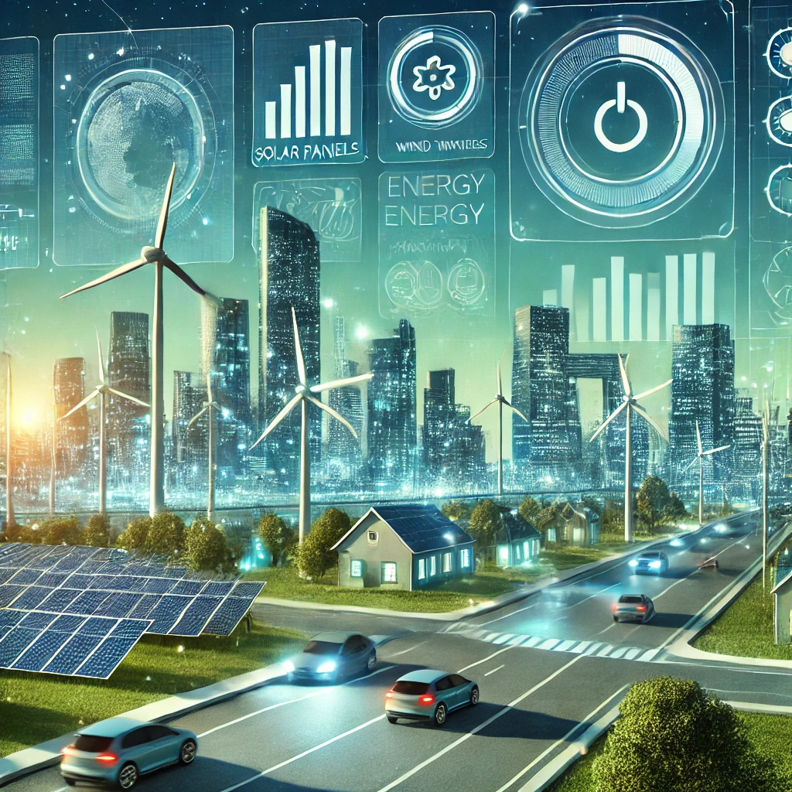

# ⚡ Energy Consumption Forecasting in Europe 🚀




## 📌 Project Overview

This project focuses on predicting energy consumption trends across various European countries using state-of-the-art machine learning techniques. By analyzing historical energy usage data, the goal is to generate reliable forecasts up to the year **2030** and provide users with an intuitive, interactive **Streamlit dashboard** for visualization and exploration.

Understanding energy consumption patterns is crucial for efficient power distribution, sustainability initiatives, and economic planning. By leveraging **machine learning models**, we can enhance energy efficiency, anticipate future demands, and support renewable energy integration into national grids.

---

## 📁 Project Structure

```
energy-prediction-eu/
│-- data/                        # 📊 Raw and processed data
│   ├── time_series_60min.csv    # Initial dataset (historical energy consumption)
│   ├── predicciones/            # Predictions per country (CSV files)
│-- results/                     # 📈 Generated plots & visualizations
│-- app/                         # 🖥️ Streamlit application
│   ├── app.py                   # Main Streamlit app for data visualization
│-- .gitignore                   # 🚫 Ignore unnecessary files (cache, logs, etc.)
│-- README.md                    # 📜 Documentation
│-- requirements.txt             # 📦 Python dependencies for installation
│-- packages.txt                 # 🛠 System dependencies for deployment
│-- energy-prediction.ipynb      # 🔬 Jupyter Notebook for data processing & modeling
```

---

## 📡 Data Source

The **historical energy consumption dataset** was obtained from the **[ENTSO-E Transparency Platform](https://transparency.entsoe.eu/)**, which provides:
- Real-time energy consumption data across European nations ⚡
- Renewable energy production (solar, wind, hydro) 🌞💨💧
- Price day-ahead markets 💰
- Load and demand forecasts 📈

This dataset allows us to analyze national energy trends and predict future demand, aiding in decision-making for policymakers, researchers, and businesses in the energy sector.

---

## 🔍 Key Features & Functionality

✅ **Data Preprocessing & Cleaning** 🛠️  
- Handling missing values, outliers, and inconsistencies.
- Feature engineering (lag features, rolling means, seasonal indicators).

✅ **Time Series Forecasting with ML Models** 📈  
- Machine learning models trained on historical consumption data.
- Multi-country segmentation for more localized predictions.

✅ **Normalization & Feature Engineering** 🔍  
- Standardized feature scaling for improved model performance.
- Consideration of time-based features (year, month, day, day of the week).

✅ **Segmentation by Country** 🌍  
- Predictions generated individually for each European country.
- Results stored in a structured CSV format for easy access.

✅ **Export Predictions to CSV** 📂  
- Future energy consumption values exported for further analysis.
- Each country has its own dedicated CSV file inside `data/predicciones/`.

✅ **Interactive Streamlit Dashboard** 🖥️  
- User-friendly web interface for exploring predictions visually.
- Dropdown selection to filter by country and forecast range.
- Time series plots comparing historical and forecasted values.

---

## 📌 Setup Instructions

### 1️⃣ Install Required Dependencies

Ensure you have Python installed and then execute:
```bash
pip install -r requirements.txt
```
If deploying, also install system dependencies listed in `packages.txt`.

### 2️⃣ Run the Streamlit App
```bash
cd app
streamlit run app.py
```
This will launch an interactive web-based application for data visualization and exploration.

---

## 📊 Model & Prediction Details

We employed advanced machine learning techniques to optimize energy consumption forecasting:

🔹 **Random Forest Regressor 🌲** – Handles complex relationships and feature importance.
🔹 **XGBoost 🚀** – Gradient boosting model, optimized for speed and accuracy.
🔹 **LightGBM ⚡** – Efficient for large-scale datasets with high performance.

### 🏆 Model Evaluation & Metrics
To ensure the highest accuracy, models were evaluated using:
- **Mean Absolute Error (MAE)** 📉
- **Mean Squared Error (MSE)** 🔍
- **Root Mean Squared Error (RMSE)** ⚖️
- **R² Score** 📊

By comparing these metrics, we selected the most robust models for deployment.

---

## 📈 Example Prediction Output (CSV format)

Each country’s forecasted energy consumption is saved in a CSV file within `data/predicciones/`. The format includes:

```
ds, prediction
2024-01-01, 54000.5
2024-01-02, 54210.2
...
2030-12-31, 62000.8
```

The `ds` column represents the **date**, while the `prediction` column provides the estimated energy consumption (GWh) for that date.

---

## 📊 Visualization & Insights

🔹 **Graphs & Charts** – We generate time series plots to visualize trends.
🔹 **Historical vs. Predicted Comparison** – Evaluate model accuracy.
🔹 **Country-Specific Analysis** – Explore energy demand variations across Europe.

All visualizations are **stored in the `results/` folder** for further analysis.

---

## 🛠 Future Enhancements & Next Steps

🚀 **Integration of Deep Learning Models** 🤖
- Experiment with LSTMs, Transformers, or other deep learning architectures.

📊 **Enhance Dashboard Interactivity**
- Add filtering, data downloads, and real-time updates.

⚡ **Incorporate Real-Time Energy Data**
- Fetch live energy consumption data for continuous monitoring.

🌱 **Sustainability Analysis**
- Study the impact of renewable energy sources on demand fluctuations.

---

## 👨‍💻 Author & Contributions

Developed by Antonio Oliver with ❤️, Python 🐍, and a passion for data science! 🎯

Contributions & feedback are welcome! Feel free to open an issue or submit a pull request. 💬

